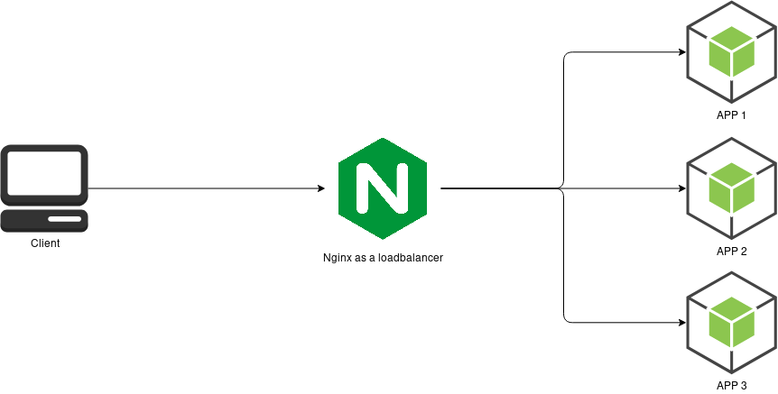

# Loadbalancer with nodejs containers

> using Nginx

This repo is the implementation of Hussein Nasser's YouTube [tutorial](https://youtu.be/BRPvjNQsqis).

## Usage

1. clone the repo
1. use `docker-compose up` to spin up the containers

## Diagram

  

